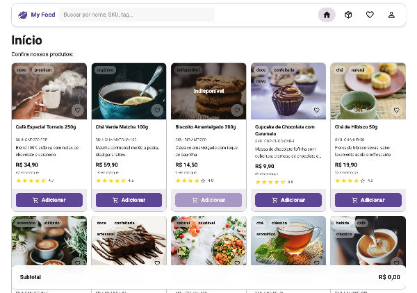

# My Food

[](https://fresh.deno.dev)

<p align="center">
  
</p>

**[My Food](https://my-food-site.carlosxfelipe.deno.net/)** é uma aplicação
construída com [Fresh](https://fresh.deno.dev), um framework moderno para Deno
que combina desempenho, simplicidade e renderização server-side reativa. O
objetivo do projeto é servir como base para um app de delivery/restaurante, com
páginas, navegação e estados já preparados para evoluir.

### Uso

Certifique-se de instalar o Deno:
https://deno.land/manual/getting_started/installation

Em seguida, inicie o projeto com:

```
deno task start
```

Isso irá observar o diretório do projeto e reiniciar conforme necessário.

## Licença

Este projeto é licenciado sob os termos da **GNU General Public License v3.0 or
later**.

Você pode ver a licença completa em [`LICENSE`](./LICENSE) ou acessá-la
diretamente [aqui](https://www.gnu.org/licenses/gpl-3.0.txt).

---

> Projeto desenvolvido com ❤️ por
> [@carlosxfelipe](https://github.com/carlosxfelipe). Contribuições são
> bem-vindas!
